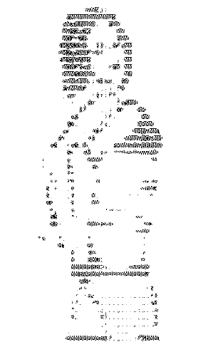

#  **Om Raghuwanshi** 

Welcome to my GitHub! 👾

I am a passionate **B.Tech in Cybersecurity** student with a keen interest in **Physics**. I specialize in **3D animation** and building tools for **OSINT (Open-Source Intelligence)**. Constantly learning, experimenting, and pushing the boundaries of technology and creativity. ⚡

---

### 🛠️ **What I'm Working On:**
This text is blue.
- Developing an **OSINT tool** to automate Google dorks and enhance information gathering. 💻🚀
- Exploring **C programming** and sharpening my problem-solving skills. 🖥️
- Studying **Physics** and delving into advanced concepts. 📚
- Experimenting with **Color Theory** and its application in digital art. 🎨

---

### 🧠 **Skills & Technologies:**
- **Cybersecurity** | **OSINT** | **3D Animation** | **Physics**  
- **Programming Languages**: C, Python, and more.
-----

### 🌐 **Let's Connect:**
- [LinkedIn](https://www.linkedin.com) 💼
- [GitHub](https://github.com) 🌟

---

### ⚡ **Fun Facts:**
- I enjoy balancing my time between **study**, **development**, and **creative work**. 🕛  
- Passionate about blending **art and science** in everything I create. 🎨

---

> **"In a world full of possibilities, code your own path."**

Feel free to explore my repositories and connect if you share similar interests! 🌟
